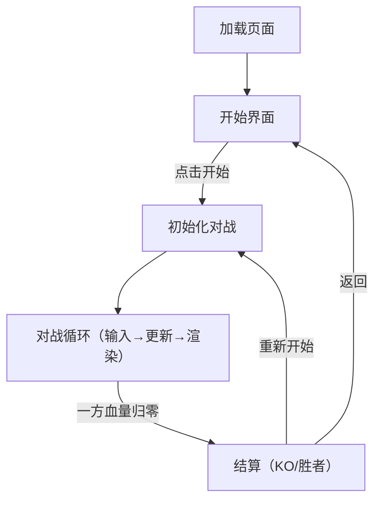

## 1. 产品概述
一个可在浏览器运行的复古像素风 1v1 机甲对战小游戏 Demo，支持双人同屏对战：移动、跳跃、攻击、防御、技能释放、受击硬直、血量与胜负判定，并包含基础场景与简易角色动画。

## 2. 核心功能

### 2.1 功能模块
1. **开始界面**：游戏标题、开始游戏、按键说明、技能选择。
2. **对战界面**：双机甲同屏、血量条、倒计时（可选）、胜负提示、重新开始。
3. **暂停/帮助（简化）**：ESC 暂停/继续；暂停时显示按键说明与重新开始。

### 2.2 页面细节
| 页面名称 | 模块名称 | 功能描述 |
|---|---|---|
| 开始界面 | 标题区 | 像素字体标题与副标题 |
| 开始界面 | 操作区 | “开始对战”“按键说明”“技能选择” |
| 对战界面 | HUD | 左右血量条、回合提示、胜负文案 |
| 对战界面 | 场景层 | 地面、远景城市剪影、像素噪点/扫描线 |
| 对战界面 | 角色层 | 2 个机甲、行走/跳跃/攻击/防御/技能/受击动画（简化帧动画） |
| 对战界面 | 结算层 | KO 文案、胜者、重新开始 |

## 3. 核心玩法与规则

### 3.1 角色属性（初版固定）
- 最大血量：100
- 移动速度：恒定（可配置）
- 跳跃：单段跳；可在空中越过对手
- 攻击：近战短距离（判定框碰撞）
- 防御：按住防御键进入格挡；可减伤并增加击退抗性
- 技能：开战前从 2 种技能中选择 1 种，战斗中独立释放

### 3.2 操作设计（默认键位）
- 玩家 1：
  - 移动：A/D
  - 跳跃：W
  - 攻击：J
  - 防御：K（按住）
  - 技能：L
- 玩家 2：
  - 移动：方向键 ←/→
  - 跳跃：↑
  - 攻击：1（或 U）
  - 防御：2（或 I）
  - 技能：3（或 O）

### 3.3 战斗机制（简化但“可玩”）
- **朝向**：角色的攻击与防御方向跟随最近一次水平移动方向改变；空中也保留该朝向。
- **跳跃与越人**：
  - 跳跃后具有垂直速度与重力，落地恢复地面对战状态。
  - 空中不执行地面推挤，可从对手头顶越过并落在其身后。
- **攻击判定**：
  - 攻击启动若干帧后生成一个短矩形判定框（hitbox）。
  - 攻击方向与当前朝向一致，命中对手的受击框（hurtbox）则造成伤害与击退。
  - 攻击存在冷却；冷却中不可连续出招。
- **防御判定**：
  - 仅当攻击来自角色当前面朝的正前方时，防御才生效。
  - 防御状态下，若被攻击命中：伤害降低（例如 70% 减伤），击退降低，受击硬直缩短。
  - 防御状态仍可水平缓慢移动（或禁止移动，二选一）。
- **技能系统**：
  - 每个玩家在开始界面选择 1 个技能，战斗中通过独立按键释放。
  - 技能 A“突进斩”：朝当前朝向快速突进并释放更长的斩击判定，适合追击。
  - 技能 B“脉冲炮”：向当前朝向释放短距离能量冲击，适合中距离压制。
  - 技能带有独立冷却，HUD 显示当前技能名称。
- **硬直与不可操作**：
  - 受击后短暂硬直，不能攻击；移动受限。
- **胜负**：
  - 任一方血量 ≤ 0，显示 “KO” 与胜者；按 R 或点击“重新开始”重开。

### 3.4 视觉与动画（像素风）
- 角色由“像素块”构成（程序化绘制或小图集均可）。
- 动画以状态机驱动：Idle/Walk/Jump/Attack/Skill/Block/Hit/KO；每个状态 2–6 帧循环或一次性播放。
- 场景包含：像素地面、远景剪影、扫描线/颗粒噪点（CSS 或 Canvas 后处理）。

## 4. 交互与流程

### 4.1 主流程
1) 进入开始界面 → 2) 点击开始 → 3) 对战进行 → 4) KO 结算 → 5) 重新开始/返回

## 5. 用户界面设计

### 5.1 设计风格
- 主题：复古街机机甲、工业蓝绿荧光、CRT 扫描线
- 主色：深灰黑（背景）+ 霓虹青/酸绿（高亮）+ 橙红（受击/警告）
- 字体：像素风标题字（优先使用开源像素字体，或内置点阵替代）
- 按钮：像素边框 + 轻微抖动/闪烁动效
- 画面：低分辨率渲染后放大（nearest-neighbor），强化像素颗粒

### 5.2 页面设计概览
| 页面名称 | 模块名称 | UI 元素 |
|---|---|---|
| 开始界面 | 标题区 | 像素标题、动态扫描线背景、简短玩法说明 |
| 开始界面 | 操作区 | 开始按钮、按键说明、技能卡片选择 |
| 对战界面 | HUD | 左右血条、玩家标识、技能名称、KO/胜者文案、重开按钮 |
| 对战界面 | 主画布 | 像素场景+角色+跳跃阴影+受击闪烁+技能特效 |

### 5.3 响应式
- 桌面优先（键盘双人）。
- 画布自适应缩放以适配不同分辨率；保持固定纵横比，采用 letterbox。

## 6. 基础素材方案（可完全自制/程序化）

### 6.1 角色素材（两套配色 + 同结构）
- 机甲由若干矩形像素块拼装（头/躯干/臂/腿/武器），通过程序化绘制生成不同配色皮肤。
- 动画帧：通过在不同状态下改变部件角度/位移（或使用小图集），补充空中姿态与技能动作。

### 6.2 场景素材
- 地面：重复像素砖块纹理（程序化噪点 + 线条）
- 远景：城市剪影（多层视差，低频抖动）
- 特效：攻击挥砍弧线（像素线）、命中火花（像素粒子）、受击闪白（短暂色相翻转）、技能能量波/残影

### 6.3 音效（可选）
- 轻量占位：按钮“咔哒”、挥砍“嗖”、命中“砰”、KO 提示音（WebAudio 生成或后续替换）
