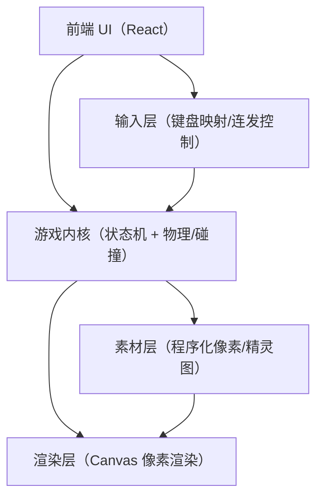

## 1. 架构设计

## 2. 技术说明
- 前端：React@18 + TypeScript + Vite
- 样式：原生 CSS（少量变量 + 像素化缩放 + CRT 叠层）
- 渲染：HTMLCanvasElement + requestAnimationFrame
- 音频（可选）：WebAudio API（简单振荡器与包络）
- 后端：无
- 数据：纯内存状态；开始界面保存双方技能选择并传入对战初始化

## 3. 路由定义
| 路由 | 用途 |
|---|---|
| / | 单页：开始界面 + 对战界面（内部分屏/状态切换） |

## 4. 核心代码结构（建议）
- src/
  - App.tsx（路由入口）
  - pages/
    - Home.tsx（开始界面与战斗界面切换、技能配置）
  - game/
    - types.ts（玩家状态、跳跃参数、技能类型与配置）
    - config.ts（平衡参数：移动、重力、伤害、技能冷却等）
    - input.ts（键位映射、跳跃键、技能键、边沿触发）
    - math.ts（碰撞、夹取、插值）
    - state.ts（初始化、物理推进、战斗判定、技能命中）
    - render.ts（像素画布渲染、跳跃阴影、技能特效）
  - hooks/
    - useGameLoop.ts（fixed timestep、对战重开、载入技能配置）
  - components/
    - StartScreen.tsx（开始界面、技能选择）
    - Hud.tsx（血条、技能名、结算）
    - PixelButton.tsx（像素按钮）
  - main.tsx
  - index.css

## 5. 游戏循环策略
- 采用固定时间步长（fixed timestep）更新逻辑，渲染与逻辑解耦：
  - 逻辑：以 60Hz（dt=16.67ms）推进状态，保证判定稳定
  - 渲染：跟随 requestAnimationFrame，按插值显示（初版可不插值）
- React 仅负责 UI 与容器，游戏状态存于自定义 hook 内（useGameLoop），避免频繁 setState 导致抖动：
  - 游戏状态：存于 useRef
  - HUD：只订阅必要的派生值（血量/胜负/暂停/技能名）
- 跳跃系统：
  - 玩家增加 `vy`、`onGround` 与重力推进
  - 地面推挤仅在双方落地时生效，保证可空中越人
- 朝向与格挡：
  - 玩家保存独立 `facing`
  - 仅最近水平输入改变朝向，不再强制面向敌人
  - 格挡根据攻击来向与当前朝向决定是否成功
- 技能系统：
  - 开始界面选择技能类型，创建对战状态时写入玩家 loadout
  - 技能拥有独立冷却与判定，渲染层按技能类型绘制不同像素特效

## 6. 像素风实现要点
- 内部渲染分辨率固定（例如 320x180 或 384x216），外层按比例放大到窗口尺寸。
- Canvas 放大时使用 nearest-neighbor：
  - CSS：image-rendering: pixelated;
- CRT 叠层：
  - CSS 渐变扫描线 + 轻微噪点背景（或单独 canvas 后处理）
